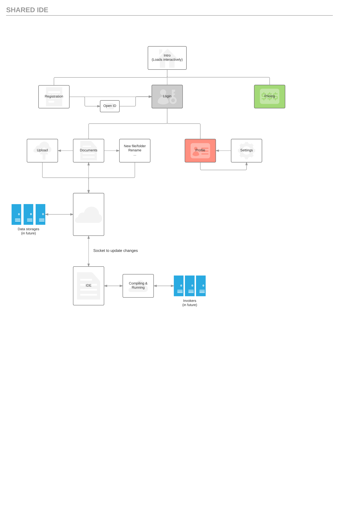

# Shared IDE

### IDE для различных целей (в основном для языков программирования) с возможностью коллективного редактирования и запуска.

#### Ключевая функциональность:

* Авторизация
    * *(возможно)* Поддержка авторизации без пароля (OpenID)
* Создание документов, импорт/экспорт
* Общий доступ по логину или ссылке
* *(возможно)* Импорт контактов, чтобы было проще открывать доступ
* **(Main feature)** Коллективное редактирование документов
    * Синхронизация изменений
    * Отображение нескольких курсоров
    * Экспорт в случае разрыва соединения
    * Какая-то реализация отмены
* *(какой-то поднабор будет реализован)* Специфическое редактирование разных типов документов:
    * Языки программирования: компиляция, запуск на тестах
        * *(возможно)* Подсветка синтаксиса
        * *(возможно)* Автодополнение кода
    * LaTeX: сборка pdf.
    * WYSIWYG-редактор
* *(возможно)* Резервные копии (aka коммиты) версий. Пока не очень понятно, нужно ли это вообще

#### Стек технологий:

* Back-end: Django/PHP/Rust, пока использую Django
* Front-end: JS с классным framework'ом, скорее всего React
* Синхронизация изменений: WebSocket

#### Примерная суть:

